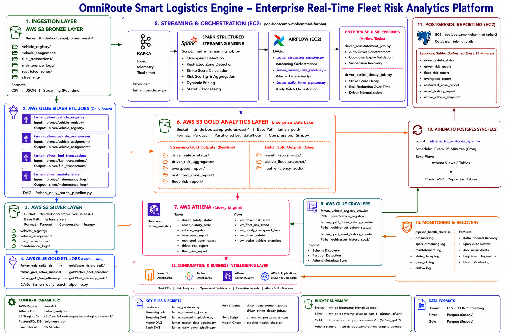

# OmniRoute Smart Logistics Engine
## Enterprise Real-Time Fleet Risk Analytics Platform



---

## Project Overview

OmniRoute is an enterprise-grade real-time fleet risk analytics platform built using:

- Apache Kafka
- Apache Spark Structured Streaming
- Apache Airflow
- AWS Glue
- AWS Athena
- AWS S3
- PostgreSQL

The platform performs:

- Real-time telemetry ingestion
- Overspeed detection
- Restricted-zone detection
- Strike score calculation
- Driver risk scoring
- Fleet risk aggregation
- PostgreSQL reporting synchronization

---

## Architecture Summary

### Streaming & Orchestration EC2
**Server:** `172.31.16.4`

Contains:
- Kafka
- Spark
- Airflow
- Producer
- Streaming jobs
- Risk engines

### Reporting EC2
**Server:** `172.31.20.140`

Contains:
- PostgreSQL
- Reporting sync
- Reporting virtual environment

---

## Main Components

### Kafka
Topic:
```bash
telemetry
```

### Spark Streaming
Main script:
```bash
farhan_streaming_job.py
```

### Airflow DAGs
Location:
```bash
/home/ubuntu/airflow/dags/
```

DAGs:
- farhan_streaming_pipeline.py
- farhan_master_data_pipeline.py
- farhan_daily_batch_pipeline.py

### PostgreSQL Database
```bash
telemetry_db
```

---

## S3 Layers

### Bronze
- vehicle_registry
- vehicle_assignment
- fuel_transactions
- maintenance_logs
- restricted_zones

### Silver
- vehicle_registry
- vehicle_assignment
- fuel_transactions
- maintenance_logs

### Gold
- driver_safety_status
- asset_history_scd2
- active_fleet_snapshot
- fuel_efficiency_audit

---

## Quick Start

### Start Kafka
```bash
nohup ~/kafka_2.13-3.6.1/bin/zookeeper-server-start.sh ~/kafka_2.13-3.6.1/config/zookeeper.properties > ~/zookeeper.log 2>&1 &

nohup ~/kafka_2.13-3.6.1/bin/kafka-server-start.sh ~/kafka_2.13-3.6.1/config/server.properties > ~/kafka.log 2>&1 &
```

### Start Spark Streaming
```bash
nohup /home/ubuntu/spark/bin/spark-submit --packages org.apache.spark:spark-sql-kafka-0-10_2.12:3.5.1,org.apache.hadoop:hadoop-aws:3.3.4 /home/ubuntu/farhan_streaming_job.py > /home/ubuntu/spark_streaming.log 2>&1 &
```

### Start Airflow
```bash
source ~/airflow_venv/bin/activate

airflow scheduler -D

airflow webserver -D -p 8080
```

### PostgreSQL Login
```bash
psql -h localhost -U farhan -d telemetry_db
```

---

## Athena Objects

### Tables
- driver_safety_status
- asset_history_scd2
- vehicle_registry

### Views
- vw_driver_risk_score
- vw_driver_behavior_trend
- vw_fleet_risk_trend
- vw_active_vehicle_snapshot
- vw_overspeed_summary
- vw_restricted_zone_summary

---

## Monitoring Logs

```bash
tail -f /home/ubuntu/producer.log

tail -f /home/ubuntu/spark_streaming.log

tail -f /home/ubuntu/enterprise_reporting_sync/logs/sync.log
```

---

## Full Beginner Deployment Guide

Use the complete deployment handbook:

```text
OmniRoute_Zero_to_Production_Operations_Handbook_FINAL.docx
```

This handbook contains:
- complete EC2 setup
- installation commands
- Airflow configuration
- PostgreSQL configuration
- Glue setup
- Athena SQL
- reporting sync
- troubleshooting
- production deployment steps

---

## Author

Mohammad Farhan

Enterprise Real-Time Fleet Risk Analytics Platform
